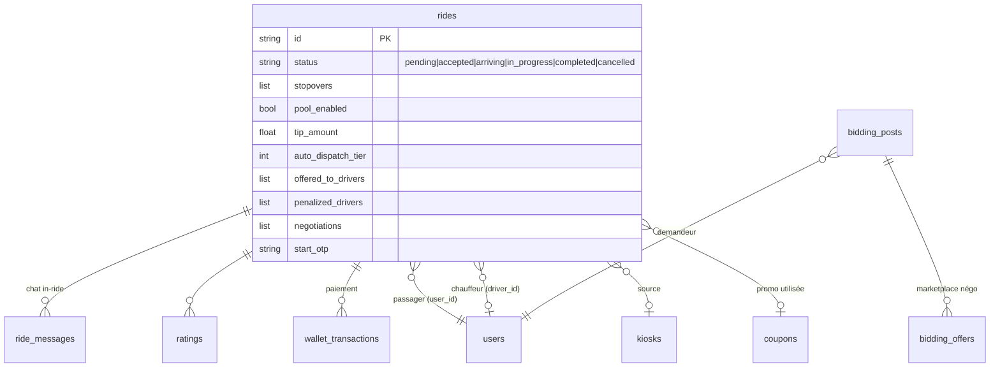
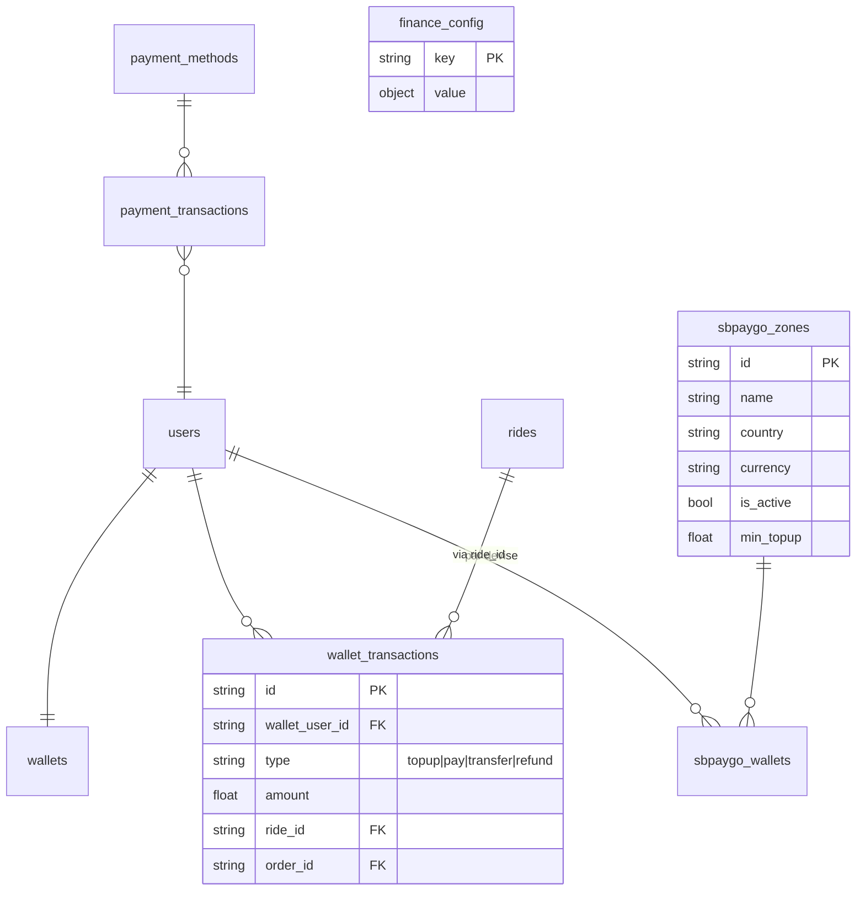
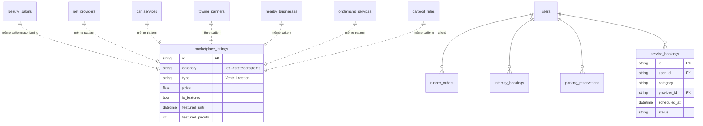
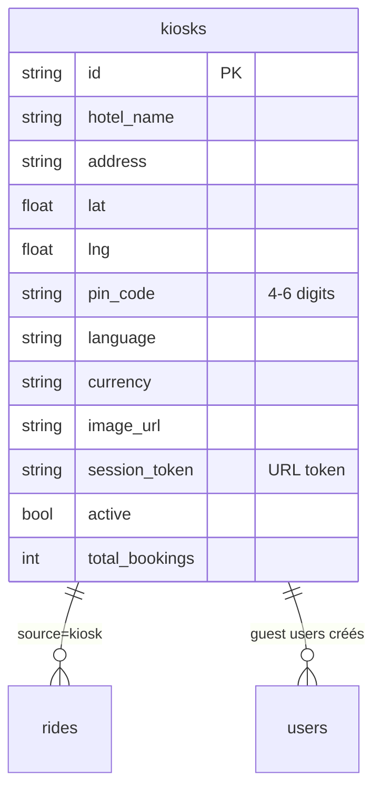
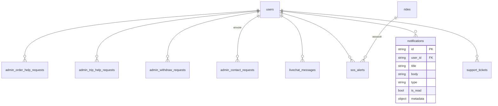
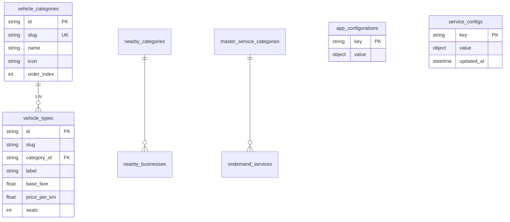

# SB Drive VTC — Diagramme Base de Données

> **Version 1.0 (Jun 1, 2026)** — Diagramme Mermaid ER de l'écosystème complet.
> Visualisable directement sur GitHub ou via Mermaid Live Editor : https://mermaid.live/

## 🌍 Vue d'ensemble (entités principales)

```mermaid
erDiagram
    users ||--o| drivers : "1:1 (role=driver)"
    users ||--o| merchants : "1:1 (role=merchant)"
    users ||--|| wallets : "1:1"
    users ||--o{ sbpaygo_wallets : "1:N par devise"
    users ||--o{ addresses : "favoris"
    users ||--o{ emergency_contacts : "SOS"
    users ||--o{ rides : "passager"
    users ||--o{ rides : "chauffeur"
    users ||--o{ orders : "commandes"
    users ||--o{ ratings : "donne"
    users ||--o{ notifications : "reçoit"
    users ||--o{ referrals : "parrain/parrainé"
    users ||--o{ favorite_drivers : "favoris"
    users ||--o{ support_tickets : ""
    users ||--o{ sos_alerts : "déclenche"
    users ||--o{ gift_cards : "achète"

    drivers ||--o{ rides : "assigné"
    drivers ||--o{ favorite_drivers : "favori de"

    merchants ||--o{ products : "vend"
    merchants ||--o{ orders : "reçoit"

    rides ||--o{ ride_messages : "chat"
    rides ||--o{ ratings : "noté"
    rides ||--o{ wallet_transactions : "paye"

    kiosks ||--o{ rides : "source=kiosk"

    coupons ||--o{ coupon_usage : "utilisé"

    sbpaygo_zones ||--o{ sbpaygo_wallets : "config"

    orders ||--o| carts : "panier source"

    users {
        string id PK
        string email UK
        string phone
        string role
        string panel_preference
        bool is_verified
    }
    drivers {
        string id PK
        string user_id FK_UK
        string status
        bool is_online
        float rating
        int points
        string palette
    }
    rides {
        string id PK
        string booking_no
        string user_id FK
        string driver_id FK
        string status
        float estimated_fare
        float final_fare
        string payment_method
        string source
        string kiosk_id FK
    }
    kiosks {
        string id PK
        string hotel_name
        string pin_code
        string session_token
        bool active
    }
    wallets {
        string user_id PK
        float balance
    }
    merchants {
        string id PK
        string user_id FK
        string store_type
        bool is_active
    }
```

---

## 🚗 Domaine Rides détaillé



---

## 💰 Domaine Finance détaillé



---

## 🛒 Domaine Marketplace & Services (catalogues sponsorisables)



---

## 🏨 Domaine Kiosk (SB Drive Tab)



---

## 📩 Domaine Support / Notifications



---

## ⚙️ Domaine Config (référentiels seedés au startup)



---

## 🎯 Légende des cardinalités

| Notation Mermaid | Signification |
|---|---|
| `||--||` | 1:1 strict |
| `||--o|` | 1:0..1 (optionnel à droite) |
| `||--o{` | 1:0..N |
| `||--|{` | 1:1..N |
| `}o--||` | N:1 obligatoire |
| `}o--o|` | N:0..1 |
| `||..||` | relation faible (même pattern) |

## 📌 Notes d'architecture

1. **Schéma denormalisé** : MongoDB privilégie les documents imbriqués (ex: `stopovers[]` dans `rides`, `replies[]` dans `support_tickets`). FK soft via string id, pas de contraintes référentielles strictes.
2. **Sponsoring transversal** : 8 catalogues (`beauty_salons`, `pet_providers`, …) partagent les 3 champs `is_featured` / `featured_until` / `featured_priority` → tri auto + auto-expiry au passage de l'endpoint public.
3. **Kiosk Guest Users** : créés à la volée via phone lors d'un `POST /api/kiosk/{token}/book` (flag `is_kiosk_guest=true`). Pas de password (placeholder `$kiosk_guest$`).
4. **Score Log inline** : `drivers.score_log[]` plafonné à 200 entrées (slice au push) — à externaliser si scaling.
5. **Phase B (panels)** : pas de nouvelle collection, juste un champ `panel_preference` sur `users` (admins).

Pour visualiser ces diagrammes :
1. Coller le bloc Mermaid sur https://mermaid.live/
2. OU ouvrir ce fichier sur GitHub (rendu Mermaid natif)
3. OU utiliser l'extension VS Code "Markdown Preview Mermaid Support"
